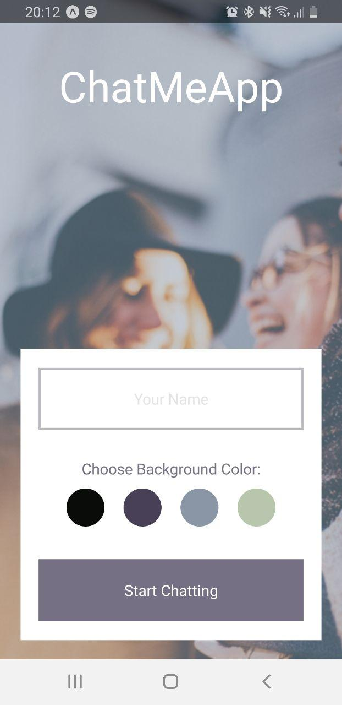
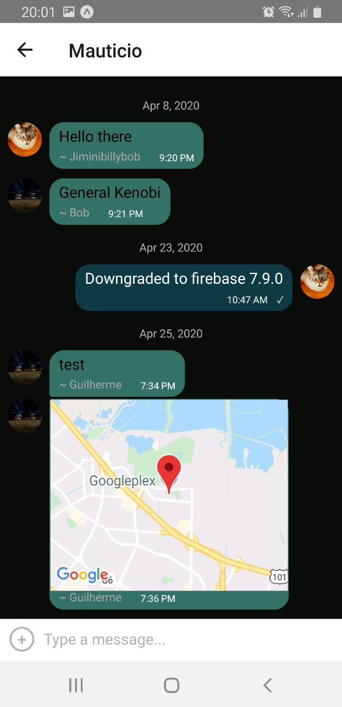

# ChatMeApp

## Summary:
 * A chat application using _React Native_ and [Gifted Chat](https://github.com/FaridSafi/react-native-gifted-chat). 
 * Using [Expo-cli](https://expo.io/)   to set up the project. 
 * Use _Android_ emulators and _iOS_ simulators to see how the app looks and behaves in different environments.

## Key Features
 * Data gets stored online and offline.
 * A page displaying the conversation, as well as an input field and submit button.
 * The chat must provide users with two additional communication features: sending images and location data.
 * A page where users can enter their name and choose a background color for the chat screen before joining the chat.

### Installation instructions

 * To run the app, you must first install [expo-cli](https://expo.io/tools#cli).
 * Once Expo is installed, navigate to the root directory and run **npm i**. 
 * Next, you can start the app by running **expo start** . This will launch _DevTools_ on **port 19002**. 
 * You can either scan the barcode using a mobile device (expo app required:  [Android](https://play.google.com/store/apps/details?id=host.exp.exponent&hl=en)  or  [iOS](https://apps.apple.com/de/app/expo-client/id982107779)) or use a [simulator](https://developer.apple.com/library/archive/documentation/IDEs/Conceptual/iOS_Simulator_Guide/GettingStartedwithiOSSimulator/GettingStartedwithiOSSimulator.html) or [emulator](https://developer.android.com/studio/run/emulator).

### Required Dependencies

 * To install all dependencies, you can simmply run **npm i** from the root directory.

 * Used dependencies: 
    * expo,
    * react,
    * firebase,
    * react-dom,
    * react-native,
    * expo-location,
    * react-navigation,
    * react-native-web,
    * expo-permissions,
    * react-native-maps,
    * expo-image-picker,
    * react-native-screens,
    * react-navigation-stack,
    * react-native-reanimated,
    * react-native-gifted-chat,
    * react-native-gesture-handler,
    * react-native-keyboard-spacer,
    * react-native-safe-area-context,
    * @react-native-community/netinfo,
    * @react-native-community/masked-view

### Setting up the database
 1. Head to [Firebase](https://firebase.google.com/) click on _Sign in_ in the upper-right corner. 
 2. Use your Google credentials to sign in and create a new Firebase account, unless you already have one.
 3. Next, click on the _Go to console_ link, which is also in the top-right corner of the window, and choose _Add project_.
 4. Give your project a name, With the default settings selected, agree to the terms and click _Create Project_.
 5. Create a database by clicking on _Develop_ from the menu and, from the additional menu that appears, select _Database_.
 6. Next, choose _Create database_ in the Cloud Firestore section.
 7. It is important that you make sure you are creating a Firestore Database and not a Realtime Database.
 8. Before you can start adding data into it, you first need to set up some security rules for your database.

### Design Specifications
 * Vertical and horizontal spacing evenly distributed
 * App title: font size 45, font weight 600, font color #FFFFFF
 * Color options HEX codes: #090C08; #474056; #8A95A5; #B9C6AE
 * “Your name”: font size 16, font weight 300, font color #757083, 50% opacity
 * “Choose background color”: font size 16, font weight 300, font color #757083, 100% opacity
 * Start chatting button: font size 16, font weight 600, font color #FFFFFF, button color#757083

 ### Technical Requirements
 * The app must be written in _React Native_.
 * The app must be developed using _Expo.io_.
 * Chat conversations must be stored locally.
 * The app must store images in _Firebase Cloud Storage_.
 * The app must be able to read the user’s location data.
 * Location data must be sent via the chat in a map view.
 * The app must be styled according to specific screen design.
 * Chat conversations must be stored in _Google Firestore Database_.
 * The app must let users pick and send images from the phone’s image library.
 * All _React Native_ code must be valid and linted according to given requirements.
 * The app must authenticate users anonymously via _Google Firebase authentication_.
 * The chat interface and functionality must be created using the _Gifted Chat library_.
 * The app must let users take pictures with the device’s camera app, and send them.

### Kanban board

[ChatMeApp-Kanban-board](https://trello.com/b/V7NtcA89/chatapp)

### Images

